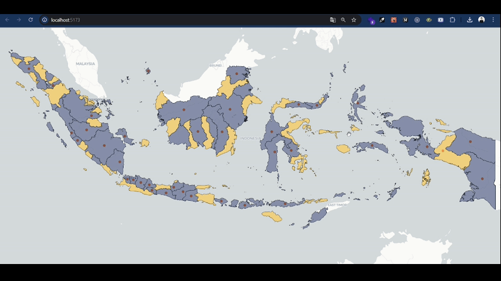

## Dashboard webgis

This repository is used to display area and location data, with a main feature that allows users to focus on a selected area by changing its color.

## Data requirements

- Vektor locations
- Vektor areas
- OSM tiles

## Technology

- React.js
- Tailwind.css
- Geoserver
